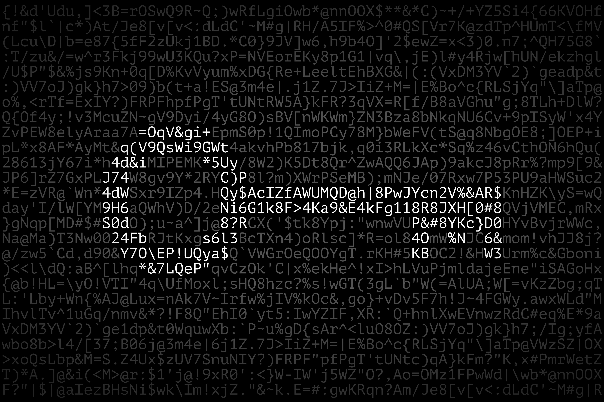

# Cybersecurity and OSINT VM Setup Script

## Overview

This repository contains a Bash script designed for automatically setting up a virtual machine (VM) with a suite of
tools essential for cybersecurity, open-source intelligence (OSINT), and digital forensics. The script is tailored for
Ubuntu 22.04 and includes a range of tools from basic utilities to more specialized software for cyber investigations.

[](https://twitter.com/intent/follow?screen_name=ryd3v)



## Purpose

The primary goal of this script is to streamline the setup process for professionals and enthusiasts in the fields of
cybersecurity and digital forensics. Whether you're setting up a new VM for testing, training, or actual investigations,
this script aims to reduce the manual effort required to install and configure the necessary tools.

## Tools Included

The script installs a variety of tools, including but not limited to:

- **General Utilities**: Basic tools like `curl`, `wget`, and `git`.
- **Cybersecurity Tools**: Software like `nmap`, `wireshark`, and `metasploit-framework`.
- **OSINT Tools**: Tools such as `theHarvester`, `Maltego` (manual installation required), and `sherlock`.
- **Digital Forensics Tools**: Applications like `Autopsy`, `Sleuth Kit`, and various Python-based utilities.

### Tools are installed in ``/opt/Tools``

## Installation

1. Clone this repository or download the script to your Ubuntu 22.04 VM.
2. Make the script executable:
   ```bash
   chmod +x osint.sh
   ```
3. Run the script with administrative privileges:
   ```bash
   sudo ./osint.sh
   ```

## Usage

After running the script, all the listed tools will be installed and configured on your VM. Some tools may require
additional setup or manual installation.

## Customization

You can modify the script to add or remove tools based on your specific requirements. Please review each tool's license
and usage guidelines.

## Contribution

Contributions to the script are welcome. If you have suggestions or improvements, please open an issue or submit a pull
request.

## Disclaimer

This script is provided "as is", and the author(s) are not responsible for any misuse or damage caused by this tool.
Ensure you have the proper authorization before using these tools in any testing environment.

## License

[](https://opensource.org/licenses/MIT)
